# FLOW MAP — the entire pipeline, data flow, LLM steps, inputs & outputs

*Single source of truth for how a run works. Authored 2026-08-07 under W8-9; re-audited
after live run `2026-08-07_e4d8`; **rebuilt under W8-10** (commit `f4b2943`, 515 tests)
from the three-lens output audit + the Virlo inspiration-fidelity trace. Status: 🟢
live-proven (e4d8) · 🆕 W8-10 (built + offline-tested, awaiting the confirmation run).
Update this file AND republish the artifact (same URL) on every flow amendment — standing
PRD rule.*

---

## 1. The whole flow at a glance (W8-10 order — ranking now precedes analysis)

```mermaid
flowchart TD
    subgraph SOURCES["📡 SOURCES"]
        V["Virlo monitor v2 🟢 — ALL FREE READS<br/>/videos + /slideshows: captions, hooks,<br/>panel texts, metrics, theme intelligence<br/>+ real creative images (thumbnails + panels)"]
        FREE["4 free collectors 🟢<br/>HackerNews · Google News EN+CS<br/>HuggingFace · ProductHunt"]
    end

    subgraph COLLECT["STAGE: collection 🟢"]
        C1["normalize → SQLite store<br/>virlo_corpus.yaml (full rich fields)<br/>top-K image download (cap 24)<br/>🆕 virlo_media_manifest.yaml —<br/>image ↔ item join (views, captions, theme)"]
    end

    subgraph RANK["STAGE: ranking 🟢 + 🆕 R1/R3"]
        R1["deterministic composites + fit gate<br/>🆕 freshness window 14d (stale rows skip<br/>scoring, traced) · 🆕 quantile bands<br/>OUT: Scorecards, top-N per language"]
    end

    subgraph ANALYZE["STAGE: analysis 🆕 AFTER ranking — LLM (vision)"]
        NA["N-A Trend & Visual Analyst — Sonnet 5<br/>🆕 only WINNING themes, deeper (10 vids/8 slides)<br/>🆕 images views-ordered + thumbnail quota,<br/>each labeled with its item metadata<br/>OUT: viral_playbook.yaml +<br/>🆕 analyzed_items (per-creative: summary,<br/>consists_of, post_kind, person, logos,<br/>style, text, environment) +<br/>🆕 visual_profile per theme (deterministic:<br/>rates, mixes, recommended_generation_mode)"]
    end

    subgraph SPIN["STAGES: brand truth + spin 🟢 + 🆕 post_mix"]
        B1["brand truth — brand_facts + claim snapshot"]
        S1["spin — ICP/pain/offer, distance bands<br/>🆕 allocate_post_types(post_mix):<br/>value_only / playbook / promotional,<br/>promo never first"]
    end

    subgraph COPY["STAGE: copy 🟢 + 🆕 voice"]
        NC["N-C Copywriter — Sonnet 5, temp 0.9 🆕<br/>founder first-person + 12 countable voice rules 🆕<br/>exemplars actually injected 🆕 · language pinned en 🆕<br/>value_only: zero brand grounding 🆕<br/>numbered-promise hard gate 🆕"]
        GATE["claim gate 🟢 deterministic UNCHANGED<br/>fail ⇒ repair ×2 ⇒ held"]
        NF["🆕 N-F Humanness Critic — Sonnet 5<br/>regex pre-filter ($0) → blind native-speaker<br/>editor rewrite, cross-asset repetition check<br/>rewrite re-enters claim gate;<br/>gate-fail ⇒ keep original"]
    end

    subgraph MEDIA["STAGE: media 🟢 + 🆕 dynamic modes"]
        ND["N-D Prompt Crafter — Sonnet 5<br/>🆕 mode from visual_profile (8 modes:<br/>photoreal person UGC · lifestyle sticker ·<br/>aspirational scene · live branded app UI ·<br/>meme split · flat-lay · native caption ·<br/>designed card) — editorial NOT hardcoded<br/>🆕 two-section prompts (shared STYLE block<br/>per cluster + RENDER) · image_brief on all paths<br/>🆕 real-logo rule · relevance requirement ·<br/>28-word cap · archetype rotation"]
        KIE["Kie — Nano Banana 2 $0.04/img 🟢<br/>write-ahead ledger, per-slide idempotency,<br/>caps $3/run $6/day, delta spend events<br/>🆕 pre-spend leak checks (font names,<br/>hex tokens, stray quotes — $0)"]
        NE["N-E Art-Director QA — Sonnet 5 (vision) 🆕<br/>exact text + subject relevance + logo fidelity +<br/>composition + series consistency (vs cover img)<br/>mode-aware rubric · synthetic-person policy<br/>mismatches ⇒ never pass<br/>16 reserved calls · fail ⇒ 1 regen ⇒ held"]
    end

    subgraph OUT["STAGES: packaging + digest + summary 🟢"]
        P1["pack: digest, scorecards, media +<br/>provenance (full prompts, QA verdicts 🆕)"]
        PS["process_summary.md every run"]
    end

    V --> C1
    FREE --> C1
    C1 --> R1
    R1 --> NA
    NA --> NC
    R1 --> S1
    B1 --> S1
    S1 --> NC
    NC --> GATE
    GATE -->|pass| NF
    GATE -->|fail 2x| HELD1["held — awaiting operator"]
    NF --> ND
    ND --> KIE
    KIE --> NE
    NE -->|pass| P1
    NE -->|fail 2x| HELD2["held — awaiting operator"]
    P1 --> PS

    style NA fill:#1d4ed8,color:#fff
    style NC fill:#1d4ed8,color:#fff
    style NF fill:#7c3aed,color:#fff
    style ND fill:#1d4ed8,color:#fff
    style NE fill:#1d4ed8,color:#fff
```



**Nothing publishes. Ever.** Postiz/Phase 6 stays outside this flow.

---

## 2. What changed in W8-10 and why (audit → fix traceability)

| Audit finding (run e4d8) | W8-10 fix |
|---|---|
| Style-transfer fidelity ~0% — winners 96% photoreal/92% sticker-text/71% real logos/50% people; we generated 100% editorial cards | analyzed_items + visual_profile + 8 generation modes + photographic_ugc register; mode chosen from the theme's winning distribution; editorial register no longer hardcoded |
| All 6 person/talking-head thumbnails never reached N-A (hash-sorted, sliced) | virlo_media_manifest join; views-ordered selection; thumbnail quota; images labeled in prompt; analyst_max_images 24 |
| Copywriter's logo request structurally dropped on carousel path | image_brief reaches all N-D paths; positive real-logo rule; QA logo-fidelity check |
| Copy nativeness 3–4/10; "creators are reporting" ×5 was handed BY our own prompt | prompt rewritten (founder voice, 12 countable rules, exemplars injected, temp 0.9); N-F humanness critic with cross-asset check |
| "Montserrat SemiBold"/"UII Label"/series token rendered into artwork | two-section prompts (STYLE never-render block); token metadata-only; deterministic pre-spend leak checks; QA banned-string auto-fail |
| QA passed slides with defects listed in its own mismatches; 8/11 images unreviewed | mismatches ⇒ never pass; 16 reserved QA calls; art-director rubric (relevance/logos/composition/series) |
| "6 prompts" cover shipped with 1 prompt | numbered-promise hard gate (held, never auto-ship) |
| 566 stale news rows rescored; all bands "Low"; analysis analyzed 11 themes for 3 winners | freshness window 14d; quantile bands; ranking→analysis reorder (winning themes only, deeper) |
| 4/4 posts brand-grounded (no reach engine) | generation.post_mix: value_only (zero brand grounding, handle+disclosure kept) / playbook / promotional, promo-never-first |

## 3. The LLM nodes (OpenRouter → `anthropic/claude-sonnet-5`, keys in `.env`)

| Node | Role | max_tokens | Notes |
|------|------|-----------|-------|
| **N-A** Trend & Visual Analyst (vision) | per-creative extraction (summary + consists_of + closed-vocab attributes) + theme playbook; runs AFTER ranking on winning themes only | 4000 | never fails the run; visual_profile computed deterministically in Python |
| **N-C** Copywriter | founder-voice platform-native copy; post_type-branched (value_only/playbook/promotional) | 4000 | truncation-guarded; carousel + numbered-promise validation |
| **N-F** Humanness Critic 🆕 | blind native-speaker editor; rewrite-not-score; sibling-asset repetition check | 2000 | rewrite re-enters claim gate; original kept on gate-fail; config `llm.humanness_critic_enabled` |
| **N-D** Prompt Crafter | mode-driven image prompts (two-section STYLE/RENDER) | 6000 | mode from visual_profile.recommended_generation_mode; validation + compose_prompt fallback |
| **N-E** Art-Director QA (vision) | exact text + relevance + logo fidelity + composition + series (cover as reference image); mode-aware; synthetic-person policy | 1000 | 16 reserved calls; deterministic $0 checks run first; fail ⇒ 1 regen ⇒ held |

Budget: `per_run_call_cap 60`, `per_run_usd_cap $2.00`, `qa_reserved_calls 16`.
Truncation (`finish_reason=="length"`) is never silently accepted.

## 4. Config surface (what the operator can steer)

| Key (theme yaml) | Effect |
|---|---|
| `generation.post_mix {value_only, playbook, promotional}` | per-run post-type counts; all-zero = off (current default until confirmation run) |
| `ranking.ranking_freshness_days` (14) | stale candidates skip scoring |
| `generation.llm.analyst_max_images` (24) | creatives shown to N-A |
| `generation.llm.node_overrides` | per-node max_tokens/temperature (copywriter temp 0.9) |
| `generation.llm.humanness_critic_enabled` (true) | N-F on/off |
| `generation.media.aspect_ratio_by_destination` | linkedin 16:9 🆕, instagram_feed 4:5 |
| `generation.media` caps | $3/run, 14 imgs, $6/day |
| `config/style_guide.yaml` | registers (editorial/hype/**photographic_ugc** 🆕), archetypes (+4 🆕), voice/skeleton rules (one-ask CTA 🆕) |

## 5. Per-run artifact map

```
logs/runs/<run_id>/
├── trace.jsonl / trace.md            every event, call, verdict, spend
├── process_summary.md                THE report — start here
├── virlo_corpus.yaml                 full rich corpus
├── virlo_media_manifest.yaml         🆕 image ↔ item join
├── analysis/viral_playbook.yaml      + 🆕 analyzed_items + visual_profile per theme
├── copy_requests/ copy_responses/    briefs + copy (+ 🆕 critic rewrites traced)
├── resume_state.yaml                 --resume re-entry
└── pack/media/<asset>/               hero/slide_NN.png + provenance
                                      (full prompt, mode 🆕, QA verdicts incl.
                                       relevance/logos/composition/series 🆕)
logs/artifacts/raw/<run_id>/virlo_media/   downloaded creatives (30-day retention,
                                            analysis-only, never re-published)
```

## 6. Safety rails that survive every change (do not re-derive)

- **Claim gate deterministic pass untouched** — prices never stated, only ledger numbers citable, disclosure line `[AI-generated content]` mandatory. N-F rewrites re-enter it.
- **Person policy (W8-10)**: synthetic, non-identifiable people ARE allowed (incl. faces, photoreal); identifiable real individuals/celebrity likeness BANNED (QA fails on resemblance); NSFW banned; no fake screenshots of OUR products.
- **Money**: intent row before submission, per-slide idempotency, dual caps, delta spend events (sum==ledger==balance, test-enforced), $0 deterministic checks before any spend.
- **Virlo**: GET-only, never POSTs, never loop-polls; reads free; fetched visuals analysis-only, never re-published.
- **Never publishes**: Postiz untouched until Phase 6 (one-time counsel re-ask there).
- **Frozen eval sets** (`calibration/eval/`) never read by the prompt author.
- **Flow-map artifact**: republished at the same URL on every flow amendment (PRD rule).

## 7. Status

W8-10 built and committed (`f4b2943`), 515/515 offline tests green. **Confirmation run
`2026-08-07_fa51` completed and analyzed** (exit success, 23m, $1.32 LLM + $0.24 media,
spend reconciled exactly): copy voice, post_mix 1/1/1, real n8n/Apify logos, a photoreal
UGC hero, and all new gates confirmed live — **2/6 images shippable vs 0/10 in e4d8**.
Four seams found and queued as the W8-11 fix round (full record: GOAL_ROADMAP.md → "W8-10
CONFIRMATION RUN RESULTS"):
1. same-day fetch idempotency leaves no virlo_corpus for the run → N-A skipped → Phase 8
   dynamic modes never exercised (fell back to editorial);
2. N-C slide bodies (29–37 words) vs N-D's 28-word cap are mutually unsatisfiable → all
   3 IG carousels degraded to fallback heroes;
3. compose_prompt fallback bypasses the claim gate on image text (unqualified '35,095'
   rendered) and N-E skips fallback images entirely (4/6 unreviewed);
4. copywriter invents speaker personas ("I'm Marcus/Radka") — speaker must be pinned in
   config. Also: N-C/N-F token budgets too small (every first attempt truncated).
