# FLOW MAP — the entire pipeline, data flow, LLM steps, inputs & outputs

*Single source of truth for how a run works. Authored 2026-08-07 under W8-9.
Status tags on every step: 🟢 **LIVE** (exists today, proven in run `2026-08-07_7ded`) ·
🟡 **W8-8** (landing now — process summary) · 🔵 **W8-9** (approved, being built).
Update this file whenever the flow changes.*

---

## 1. The whole flow at a glance

```mermaid
flowchart TD
    subgraph SOURCES["📡 SOURCES"]
        V["Virlo monitor v2 (intelligence)<br/>🔵 /videos 973+ items, /slideshows 202+ carousels<br/>🟢 themes+tactics (monitor read)<br/>ALL FREE READS"]
        FREE["4 free collectors 🟢<br/>HackerNews · Google News EN+CS<br/>HuggingFace · ProductHunt"]
    end

    subgraph COLLECT["STAGE: collection 🟢 (upgraded 🔵)"]
        C1["normalize → RawItem → SQLite store<br/>+ 🔵 keep FULL captions, hook_text,<br/>panel_texts, tactics, why_it_works<br/>+ 🔵 download top-K thumbnails/panels<br/>→ virlo_corpus.yaml + virlo_media/"]
    end

    subgraph ANALYZE["STAGE: analysis 🔵 NEW — LLM (vision)"]
        NA["N-A Trend & Visual Analyst<br/>Sonnet 5 via OpenRouter<br/>IN: captions + panel texts + tactics + images<br/>OUT: viral_playbook.yaml<br/>(hooks, formats, visual archetypes,<br/>tools/logos seen, numbers, platform norms)"]
    end

    subgraph RANKSPIN["STAGES: ranking + brand truth + spin 🟢"]
        R1["ranking — deterministic composites,<br/>evidence classes, dedupe/resurgence<br/>OUT: Scorecards + top-N per language"]
        B1["brand truth — brand_facts.yaml +<br/>claim snapshot (10 approved claims)<br/>stale snapshot ⇒ copy refuses"]
        S1["spin — ICP/pain/offer mapping,<br/>distance bands (far ⇒ value-only)<br/>OUT: SpinResult + rationale"]
    end

    subgraph COPY["STAGE: copy 🔵 LLM (was: operator-manual)"]
        NC["N-C Copywriter — Sonnet 5<br/>IN: viral playbook + style_guide.yaml +<br/>brand facts + spin + claim snapshot<br/>OUT per asset:<br/>• LinkedIn: long 7-beat post (150-330w, →/❌ bullets, comment-keyword CTA)<br/>• IG/TikTok: short caption + PER-SLIDE carousel texts"]
        GATE["claim gate 🟢 deterministic, UNCHANGED<br/>prices/numbers/superlatives/therapeutic/<br/>disclosure-line checks over ALL texts incl. slides<br/>fail ⇒ repair loop (2 attempts) ⇒ held"]
    end

    subgraph MEDIA["STAGE: media 🟢 (upgraded 🔵)"]
        ND["N-D Image-Prompt Crafter 🔵 — Sonnet 5<br/>IN: gate-passed texts + archetype + register +<br/>brand palette + series-consistency tokens<br/>OUT: full generation prompt per image<br/>(hero, slide_01…slide_NN)"]
        KIE["Kie jobs API 🟢 — Nano Banana 2 (standard) 🔵<br/>write-ahead spend ledger, per-slide idempotency 🔵,<br/>caps $3/run $6/day 🔵, kill/resume-safe billing 🟢"]
        NE["N-E Vision-QA Gate 🔵 — Sonnet 5 reads image back<br/>rendered text == gate-passed text? archetype ok?<br/>fail ⇒ 1 regeneration ⇒ held-for-operator"]
    end

    subgraph OUT["STAGES: packaging + digest 🟢 + 🟡"]
        P1["run pack: digest.md, scorecards,<br/>spin rationale, media + provenance<br/>(incl. FULL prompts 🟡)"]
        PS["process_summary.md 🟡 EVERY run:<br/>9 sections — what was sent/received/used,<br/>full copy, full prompts, spend<br/>+ --summarize CLI for old runs"]
    end

    V --> C1
    FREE --> C1
    C1 --> NA
    C1 --> R1
    NA --> NC
    R1 --> S1
    B1 --> S1
    S1 --> NC
    NC --> GATE
    GATE -->|pass| ND
    GATE -->|fail 2x| HELD1["held — awaiting operator"]
    ND --> KIE
    KIE --> NE
    NE -->|pass| P1
    NE -->|fail 2x| HELD2["held — awaiting operator"]
    P1 --> PS

    style NA fill:#1d4ed8,color:#fff
    style NC fill:#1d4ed8,color:#fff
    style ND fill:#1d4ed8,color:#fff
    style NE fill:#1d4ed8,color:#fff
```



**Nothing publishes. Ever.** Postiz/Phase 6 stays outside this flow (drafts-only posture,
counsel re-ask gate untouched).

---

## 2. Stage-by-stage: inputs → outputs

| # | Stage | Status | Inputs | Outputs (artifacts) | LLM? | Cost |
|---|-------|--------|--------|--------------------|------|------|
| 1 | **collection** | 🟢 + 🔵 upgrade | Virlo monitor v2 sub-paths `/videos`, `/slideshows` (free, paginated, 1 pass); theme analysis (free); 4 free collectors; ~~trends digest $0.25~~ → off by default 🔵 | SQLite signals; `virlo_corpus.yaml` (full captions, hook texts, panel texts, tactics, why_it_works, viral_tactics, top-10 breakdown) 🔵; `virlo_media/` top-K thumbnails + carousel panels 🔵; `virlo_extraction.yaml` 🟡 | no | $0 |
| 2 | **analysis** 🔵 NEW | 🔵 | virlo_corpus + downloaded images + theme tactics | `analysis/viral_playbook.yaml` — per theme: hooks that work, formats, visual archetypes seen, tools/logos shown, numbers used, per-platform norms | **N-A** Sonnet 5 (vision) | ~$0.20–0.50 |
| 3 | **ranking** | 🟢 | stored signals, dedupe index, watch topics | Scorecards (composite, fit, evidence class), top-N per language | no (fit = deterministic heuristic, labeled) | $0 |
| 4 | **brand truth** | 🟢 | `config/brand_facts.yaml`, claim snapshot (≤30 days old) | BrandFacts panel; stale ⇒ copy stage refuses | no | $0 |
| 5 | **spin** | 🟢 | Scorecard + BrandFacts | SpinResult: ICP, pain, offer, CTA class, distance band, rationale line | no | $0 |
| 6 | **copy** | 🔵 LLM (interactive-file fallback kept 🟢) | viral playbook + `style_guide.yaml` + spin + brand facts + claim snapshot + destination constraints | Per asset: headline, caption, **per-slide carousel texts**, image direction. Persisted `copy_requests/` + `copy_responses/` | **N-C** Sonnet 5 | ~$0.10–0.30 |
| 7 | **claim gate** | 🟢 UNCHANGED | all generated texts (incl. every slide + image prompts) | verdict + failing spans; 2-attempt repair loop; fail ⇒ held | no — deterministic | $0 |
| 8 | **prompt craft** 🔵 NEW | 🔵 | gate-passed texts + archetype/register from playbook + brand palette + series tokens | full image prompt per image → provenance (`prompt_full`) 🟡 | **N-D** Sonnet 5 | ~$0.05–0.15 |
| 9 | **image generation** | 🟢 + 🔵 upgrade | prompts; model registry route | PNGs via Kie (Nano Banana 2 standard 🔵, draft tier for iterations); spend ledger row BEFORE submission; per-slide idempotency `destination:slideNN` 🔵 | image model | $0.12/img std, $0.02 draft |
| 10 | **vision QA** 🔵 NEW | 🔵 | generated image + gate-passed text | verdict: text renders correctly (no typos), archetype/register adhered; 1 retry then held | **N-E** Sonnet 5 (vision) | ~$0.02/img |
| 11 | **packaging** | 🟢 | all approved assets | `pack/`: digest.md, scorecards, spin rationale, `media/<asset>/slide_NN.png` 🔵 + provenance (checksums, cost, **full prompt** 🟡) | no | $0 |
| 12 | **process summary** | 🟡 landing | trace.jsonl + resume_state + ledger + provenance | `process_summary.md` — the neat per-run report (9 sections); `--summarize <run_id>` regenerates for any past run | no | $0 |

**Typical full run (1 LinkedIn post + 1 hero + 1 six-slide IG carousel): ≈ $1.30–2.00**, under the $3/run cap.

---

## 3. The LLM nodes (all via OpenRouter → `anthropic/claude-sonnet-5`, key in `.env`)

| Node | Role | Input (exact) | Output (exact) | Failure behavior |
|------|------|---------------|----------------|------------------|
| **N-A** Trend & Visual Analyst | See what's actually working in the niche this week | Virlo theme names + tactics[] + why_it_works + viral_tactics + top-10 breakdown; top item captions + hook_texts + panel_texts; ~24 downloaded thumbnails/panels (base64) | `viral_playbook.yaml`: per-theme {winning_hooks[], formats[], visual_archetypes_seen[], tools_shown[], numbers_used[], platform_norms{}} | run continues with style_guide-only grounding; degrade traced |
| **N-C** Copywriter | Platform-native copy grounded in the playbook | viral playbook + style guide + SpinResult + brand facts + claim snapshot + prior failing spans (repair) | JSON: {headline, caption, slides[] (per-slide title+body+component), image_direction} per asset | parse-retry ×1; then interactive-file fallback (operator writes) |
| **N-D** Image-Prompt Crafter | The exact prompt Nano Banana 2 receives | gate-passed texts to render verbatim + archetype + register + palette + series-consistency tokens | full prompt string per image (persisted to provenance) | fallback to deterministic template prompt |
| **N-E** Vision-QA Gate | Compensating control for AI-rendered text | generated image (base64) + the exact text that must appear | {text_matches: bool, mismatches[], archetype_ok: bool, notes} | fail ⇒ 1 regeneration ⇒ held-for-operator (never auto-ships) |

All LLM calls: traced (tokens, latency, cost) into the spend ledger (`llm` wallet), per-run
call ceilings, offline-tested via `FixtureFetcher` canned responses.

---

## 4. Grounding & config inputs (read every run)

| File | What it feeds | Status |
|------|---------------|--------|
| `config/style_guide.yaml` | N-C + N-D: platform skeletons (LinkedIn 7-beat / IG carousel / TikTok), 12 visual archetypes, 2 registers, hook ranking, CTA stack, reject-list | 🔵 written |
| `config/brand_facts.yaml` | brand truth panel; negative capabilities (W8-9: third-party logos/screenshots/people ALLOWED; no fake screenshots of OUR products; no client names; RAGus legacy-only) | 🟢 updated |
| `config/snapshots/claim_ledger_*.yaml` | the ONLY citable numbers (10 approved claims, ≤30 days) | 🟢 |
| `config/model_registry.yaml` | image routes: nano-banana draft $0.02 / **nano-banana-2 standard $0.12** 🔵; tier_ceiling standard 🔵 | 🟢→🔵 |
| `config/hard_excludes.yaml` | topics never touched | 🟢 |
| `.env` (gitignored) | all API keys (Virlo, Kie, OpenRouter, Postiz, handle-hash) — replaces API_KEYS.txt | 🔵 created |
| `assets/brand/` | HD/HypeLead logos + 7 post templates from Notion pack (prompt reference) | 🔵 pending download |

## 5. Per-run artifact map (where to look after a run)

```
logs/runs/<run_id>/
├── trace.jsonl / trace.md        🟢 every event, API call, gate verdict, spend
├── process_summary.md            🟡 THE neat report — start here
├── virlo_extraction.yaml         🟡 what Virlo returned vs what was used
├── virlo_corpus.yaml             🔵 full rich corpus fed to N-A
├── analysis/viral_playbook.yaml  🔵 N-A output
├── copy_requests/ copy_responses/ 🟢 full briefs + copy (incl. per-slide 🔵)
├── resume_state.yaml             🟢 --resume re-entry point
└── pack/
    ├── digest.md                 🟢 2-minute outcome summary
    └── media/<asset>/            🔵 slide_01.png … + *.provenance.yaml
                                     (route, cost, checksum, FULL prompt 🟡, QA verdict 🔵)
logs/artifacts/raw/<run_id>/virlo_media/  🔵 downloaded thumbnails/panels (30-day retention,
                                             analysis-only, never re-published)
```

## 6. Safety rails that survive every change (do not re-derive)

- **Claim gate deterministic pass is untouched** — prices never stated, only ledger numbers citable, disclosure line `[AI-generated content]` mandatory, therapeutic/prohibited-outcome lexicon floor.
- **Vision-QA (N-E) is mandatory** wherever the image model renders text — it is the compensating control for text bypassing the claim gate's text surface.
- **Money**: intent row BEFORE submission, resolve-by-query on restart, dual caps, balance reconciliation — now per-slide. LLM spend joins the same ledger.
- **Virlo**: engine is GET-only, never POSTs, never polls in a loop; reads are free.
- **Third-party content**: fetched visuals are analysis input only — never re-published, never in packs; verbatim third-party text stays key+hash in traces.
- **Never publishes**: Postiz untouched until Phase 6 (with its one-time counsel re-ask).
- **Frozen eval sets** (`calibration/eval/`) are never read by the prompt author.
