# FLOW MAP — the entire pipeline, data flow, LLM steps, inputs & outputs

*Single source of truth for how a run works. Authored 2026-08-07 under W8-9; re-audited
2026-08-07 after the first full live run (`2026-08-07_e4d8`) and the defect-fix round
(commit `539e808`, 316 tests green). Status tags: 🟢 **LIVE-PROVEN** (exercised in run
e4d8) · ✅ **FIXED** (defect found in e4d8, repaired offline in `539e808`, awaiting live
confirmation) · 🟠 **PROPOSED** (re-audit recommendation, not yet decided/built).
Update this file whenever the flow changes.*

---

## 1. The whole flow at a glance

```mermaid
flowchart TD
    subgraph SOURCES["📡 SOURCES"]
        V["Virlo monitor v2 (intelligence) 🟢<br/>/videos 644 items · /slideshows 218 carousels<br/>+ themes/tactics — ALL FREE READS<br/>(9 GETs, 3.3 MB, $0 in e4d8)"]
        FREE["4 free collectors 🟢<br/>HackerNews · Google News EN+CS<br/>HuggingFace · ProductHunt"]
    end

    subgraph COLLECT["STAGE: collection 🟢"]
        C1["normalize → RawItem → SQLite store<br/>FULL captions, hook_text, panel_texts,<br/>tactics, why_it_works kept<br/>top-K image download (cap 24)<br/>→ virlo_corpus.yaml + virlo_media/"]
    end

    subgraph ANALYZE["STAGE: analysis 🟢 — LLM (vision)"]
        NA["N-A Trend & Visual Analyst — Sonnet 5<br/>IN: trimmed corpus (≤5 themes, ≤6 videos,<br/>≤4 slideshows ✅) + downloaded images<br/>OUT: analysis/viral_playbook.yaml<br/>never fails the run"]
    end

    subgraph RANKSPIN["STAGES: ranking + brand truth + spin 🟢"]
        R1["ranking — deterministic composites,<br/>fit gate, dedupe/resurgence<br/>e4d8: 658 in → 116 pass → 3 generate<br/>🟠 R1/R3: freshness window + band calibration"]
        B1["brand truth — brand_facts.yaml +<br/>claim snapshot (10 approved claims)"]
        S1["spin — ICP/pain/offer mapping,<br/>distance bands (far ⇒ value-only)<br/>proven: adjacent + far both exercised"]
    end

    subgraph COPY["STAGE: copy 🟢 LLM"]
        NC["N-C Copywriter — Sonnet 5, max_tokens 4000 ✅<br/>truncation detected via finish_reason,<br/>retry with doubled budget ✅<br/>carousel completeness check:<br/>6–10 slides + end_card, 1 retry ✅"]
        GATE["claim gate 🟢 deterministic, UNCHANGED<br/>all texts incl. every slide + image prompts<br/>fail ⇒ repair loop (2 attempts) ⇒ held<br/>proven live: caught missing disclosure,<br/>repair attempt 2 passed"]
    end

    subgraph MEDIA["STAGE: media 🟢"]
        ND["N-D Image-Prompt Crafter — Sonnet 5, 6000 tok ✅<br/>prompt-hygiene rules ✅ (no font names as text,<br/>no contentless labels, exact text sans quotes)<br/>completeness validation ⇒ compose_prompt fallback ✅"]
        KIE["Kie jobs API — Nano Banana 2 standard $0.04/img 🟢<br/>write-ahead ledger, per-slide idempotency,<br/>caps $3/run $6/day, DELTA spend events ✅"]
        NE["N-E Vision-QA Gate — Sonnet 5 (vision)<br/>exact-match rubric ✅, 16 reserved calls ✅<br/>fail ⇒ 1 regeneration ⇒ held<br/>proven live: failed slide_03, regen passed"]
    end

    subgraph OUT["STAGES: packaging + digest + summary 🟢"]
        P1["run pack: digest.md, scorecards,<br/>spin rationale, media + provenance<br/>(FULL prompts, QA verdicts)"]
        PS["process_summary.md EVERY run —<br/>9 sections + --summarize CLI"]
    end

    V --> C1
    FREE --> C1
    C1 --> NA
    C1 --> R1
    NA --> NC
    R1 --> S1
    B1 --> S1
    S1 --> NC
    NC --> GATE
    GATE -->|pass| ND
    GATE -->|fail 2x| HELD1["held — awaiting operator"]
    ND --> KIE
    KIE --> NE
    NE -->|pass| P1
    NE -->|fail 2x| HELD2["held — awaiting operator"]
    P1 --> PS

    style NA fill:#1d4ed8,color:#fff
    style NC fill:#1d4ed8,color:#fff
    style ND fill:#1d4ed8,color:#fff
    style NE fill:#1d4ed8,color:#fff
```



**Nothing publishes. Ever.** Postiz/Phase 6 stays outside this flow (drafts-only posture,
counsel re-ask gate untouched).

---

## 2. Stage-by-stage: inputs → outputs (with e4d8 actuals)

| # | Stage | Inputs | Outputs (artifacts) | LLM? | e4d8 actual cost |
|---|-------|--------|--------------------|------|------|
| 1 | **collection** | Virlo monitor v2 sub-paths `/videos`, `/slideshows` (free, ≤6 pages each, 1 pass); theme analysis; 4 free collectors; trends digest OFF by default | SQLite signals; `virlo_corpus.yaml` (full captions, hooks, panel texts, tactics, why_it_works); `virlo_media/` top-K images; `virlo_extraction.yaml` | no | $0 |
| 2 | **analysis** | trimmed virlo_corpus (≤5 themes / ≤6 videos / ≤4 slideshows / 300-char captions ✅) + ≤12 images | `analysis/viral_playbook.yaml` — per theme: hooks, formats, visual archetypes, tools shown, numbers, platform norms | **N-A** Sonnet 5 (vision) | $0.31 (was 70k-token prompt; trimmed ✅) |
| 3 | **ranking** | stored signals, dedupe index, watch topics | Scorecards, top-N per language. e4d8: 658 → 116 fit-pass → 3 generate (all 3 were Virlo themes) | no | $0 |
| 4 | **brand truth** | `config/brand_facts.yaml`, claim snapshot ≤30 days | BrandFacts panel; stale ⇒ copy refuses | no | $0 |
| 5 | **spin** | Scorecard + BrandFacts | SpinResult: ICP, pain, offer, CTA class, mapping distance, rationale. Proven: HypeLead-adjacent AND value-only(far) both produced | no | $0 |
| 6 | **copy** | viral playbook + `style_guide.yaml` + spin + brand facts + claim snapshot | headline, caption, per-slide carousel texts, image direction. Truncation-guarded, carousel-completeness-checked ✅ | **N-C** Sonnet 5 | $0.23 (10 calls) |
| 7 | **claim gate** | all generated texts incl. slides + image prompts | verdict + failing spans; 2-attempt repair; fail ⇒ held. Proven live (disclosure catch → repair pass) | no | $0 |
| 8 | **prompt craft** | gate-passed texts + archetype/register + palette + series tokens | full image prompt per image, validated complete ✅, else compose_prompt fallback | **N-D** Sonnet 5 | $0.05 (4 calls) |
| 9 | **image generation** | crafted prompts; model registry route | PNGs via Kie Nano Banana 2 (`img-standard-nano-banana-pro`, 8 credits = **$0.04/img** live-verified); ledger row BEFORE submission; per-slide idempotency | image model | $0.44 (11 submissions, balance-reconciled exactly) |
| 10 | **vision QA** | generated image + gate-passed exact text | exact-match verdict ✅; 1 retry then held; 16 reserved LLM calls guarantee coverage ✅ | **N-E** Sonnet 5 (vision) | $0.05 (4 of 11 imgs — starvation FIXED ✅) |
| 11 | **packaging** | approved assets | `pack/`: digest, scorecards, `media/<asset>/slide_NN.png` + provenance (checksum, cost, full prompt, QA verdict) | no | $0 |
| 12 | **process summary** | trace + resume_state + ledger + provenance | `process_summary.md` (9 sections); `--summarize <run_id>` | no | $0 |

**e4d8 total real cost: ≈ $1.06** ($0.62 LLM + $0.44 images) for 3 IG carousels + 1 LinkedIn
post + 10 images — well under the $3/run cap. (The run's own summary showed $2.64 media —
that was the cumulative-spend reporting bug, fixed ✅; balance moved exactly 88 credits.)

---

## 3. The LLM nodes (all via OpenRouter → `anthropic/claude-sonnet-5`, key in `.env`)

| Node | Role | max_tokens ✅ | Output | Failure behavior |
|------|------|------------|--------|------------------|
| **N-A** Trend & Visual Analyst | see what's working in the niche this week | 4000 | `viral_playbook.yaml` | run continues with style_guide-only grounding; degrade traced |
| **N-C** Copywriter | platform-native copy grounded in the playbook | 4000 | JSON: headline, caption, slides[], image_direction | truncation retry ×1 (doubled budget) → `LlmTruncatedError` degrade; parse-retry ×1; interactive-file fallback |
| **N-D** Image-Prompt Crafter | the exact prompt Nano Banana 2 receives | 6000 | full prompt per image (persisted to provenance) | completeness validation: bad slide prompt degrades the carousel set; bad hero falls back to deterministic compose_prompt |
| **N-E** Vision-QA Gate | compensating control for AI-rendered text | 1000 | {text_matches, mismatches[], archetype_ok} | fail ⇒ 1 regeneration ⇒ held (never auto-ships); draws from 16-call reserve non-QA nodes cannot consume |

Shared budget: `per_run_call_cap: 60`, `per_run_usd_cap: $2.00`, `qa_reserved_calls: 16` ✅.
All calls traced (tokens, latency, OpenRouter-reported USD) into the `llm` wallet.
`finish_reason=="length"` is detected before parsing — truncated output is never silently
accepted ✅ (e4d8's slide_04 "built for…" cut-off can no longer reach the image model).

---

## 4. Grounding & config inputs (read every run)

| File | What it feeds |
|------|---------------|
| `config/style_guide.yaml` | N-C + N-D: LinkedIn 7-beat / IG carousel / TikTok skeletons, 12 visual archetypes, 2 registers, hook ranking, CTA stack, reject-list. **This is the LinkedIn/IG grounding** — the Virlo corpus is TikTok-heavy by nature (see §7 R4) |
| `config/brand_facts.yaml` | brand truth; W8-9 negatives: third-party logos/screenshots/people ALLOWED; no fake screenshots of OUR products; no client names; RAGus legacy-only |
| `config/snapshots/claim_ledger_*.yaml` | the ONLY citable numbers (10 approved claims, ≤30 days) |
| `config/model_registry.yaml` | nano-banana-2: 8 credits / **$0.04 per image** (live-verified); tier_ceiling standard |
| `config/hard_excludes.yaml` | topics never touched |
| `.env` (gitignored) | all API keys — replaces API_KEYS.txt (deleted) |
| `assets/brand/` | HD/HypeLead logos + 7 post templates (prompt reference) |

## 5. Per-run artifact map (where to look after a run)

```
logs/runs/<run_id>/
├── trace.jsonl / trace.md        every event, API call, gate verdict, spend
├── process_summary.md            THE neat report — start here
├── virlo_extraction.yaml         what Virlo returned vs what was used
├── virlo_corpus.yaml             full rich corpus (untrimmed; N-A prompt uses a trimmed view)
├── analysis/viral_playbook.yaml  N-A output
├── copy_requests/ copy_responses/ full briefs + copy incl. per-slide
├── resume_state.yaml             --resume re-entry point
└── pack/
    ├── digest.md                 2-minute outcome summary
    └── media/<asset>/            hero.png / slide_NN.png + *.provenance.yaml
                                     (route, cost, checksum, FULL prompt, QA verdict)
logs/artifacts/raw/<run_id>/virlo_media/  downloaded thumbnails/panels (30-day retention,
                                             analysis-only, never re-published)
```

## 6. Safety rails that survive every change (do not re-derive)

- **Claim gate deterministic pass is untouched** — prices never stated, only ledger numbers citable, disclosure line `[AI-generated content]` mandatory, therapeutic/prohibited-outcome lexicon floor. Proven live in e4d8.
- **Vision-QA (N-E) is mandatory** wherever the image model renders text; its 16-call reserve means it can never again be starved by upstream nodes.
- **Money**: intent row BEFORE submission, resolve-by-query on restart, dual caps, per-slide idempotency, balance reconciliation. Proven at 11 submissions: billed exactly once each. Spend events are per-submission deltas; `sum(events) == ledger == balance delta` is test-enforced.
- **Virlo**: engine is GET-only, never POSTs, never polls in a loop; reads are free.
- **Third-party content**: fetched visuals are analysis input only — never re-published, never in packs; verbatim third-party text stays key+hash in traces.
- **Never publishes**: Postiz untouched until Phase 6 (with its one-time counsel re-ask).
- **Frozen eval sets** (`calibration/eval/`) are never read by the prompt author.

---

## 7. Q6 re-audit verdict (2026-08-07, against run e4d8 evidence)

**The backbone is structurally sound.** The chain Virlo rich corpus → N-A analysis →
ranking/spin → N-C copy → claim gate → N-D prompt craft → Nano Banana 2 → N-E vision QA
produced a step-change in quality over the pre-W8-9 pipeline, and every safety loop fired
correctly under live conditions (gate repair, QA regeneration, per-slide billing). No
rewiring of the graph is required. The e4d8 defects were all *parameter/validation* class,
not *structure* class, and are fixed in `539e808`.

Findings and recommendations, ranked:

- **R1 🟠 Ranking freshness window.** 566 of 658 candidates were stale Google News rows
  rescored from the store (0 fetched this run); none generated content — all 3 generates
  were Virlo themes. Add a fetched-within-N-days filter (or hard decay) so ranking scores
  fresh signal, not archaeology. Cheap, pure-deterministic change; also shrinks scorecard
  noise in the pack.
- **R2 🟠 Run analysis AFTER ranking.** N-A currently analyzes the whole corpus before
  ranking picks 3 topics; nothing in ranking consumes the playbook. Reordering
  collection → ranking → analysis(top-N themes only, deeper per theme) → copy cuts N-A's
  prompt further and spends its token budget on the themes that actually ship. Zero
  behavioral risk; requires moving one stage call.
- **R3 🟠 Scorecard band calibration.** Every generated topic carried "Band: Low" even at
  30× composite spread (0.0005–0.017); the absolute band thresholds predate Virlo-theme
  candidates. Make bands quantile-based per run (or recalibrate thresholds) so the band
  label carries information again. (Spin's own distance mapping is healthy — adjacent and
  far both occurred.)
- **R4 ✅-by-design, small polish.** Playbook `platform_norms` says "not observed in
  corpus" for LinkedIn/IG because Virlo's corpus is TikTok-heavy — the style guide is the
  intended LinkedIn/IG grounding. Polish: tell N-A to omit not-observed platforms instead
  of emitting noise lines, and mark playbook norms explicitly as TikTok evidence.
- **R5 🟠 deferred: parallel image submission.** e4d8's 12m09s wall clock is dominated by
  serial Kie submit→poll cycles. Parallelizing would complicate the money discipline
  (write-ahead ledger ordering) for little gain at a weekly cadence. Revisit only if runs
  grow past ~30 images.
- **R6 🟠 Confirmation re-run.** One cheap live run (~$1) after the fix round to confirm:
  full-length LinkedIn copy (no truncation holds), 6–10-slide carousels with end cards,
  100% QA coverage, delta spend reporting. Needs operator go-ahead (live spend).

Post-campaign backlog (unchanged): Czech copy path, LLM judge halves for ranking fit,
video pipeline, Postiz Phase 6.
