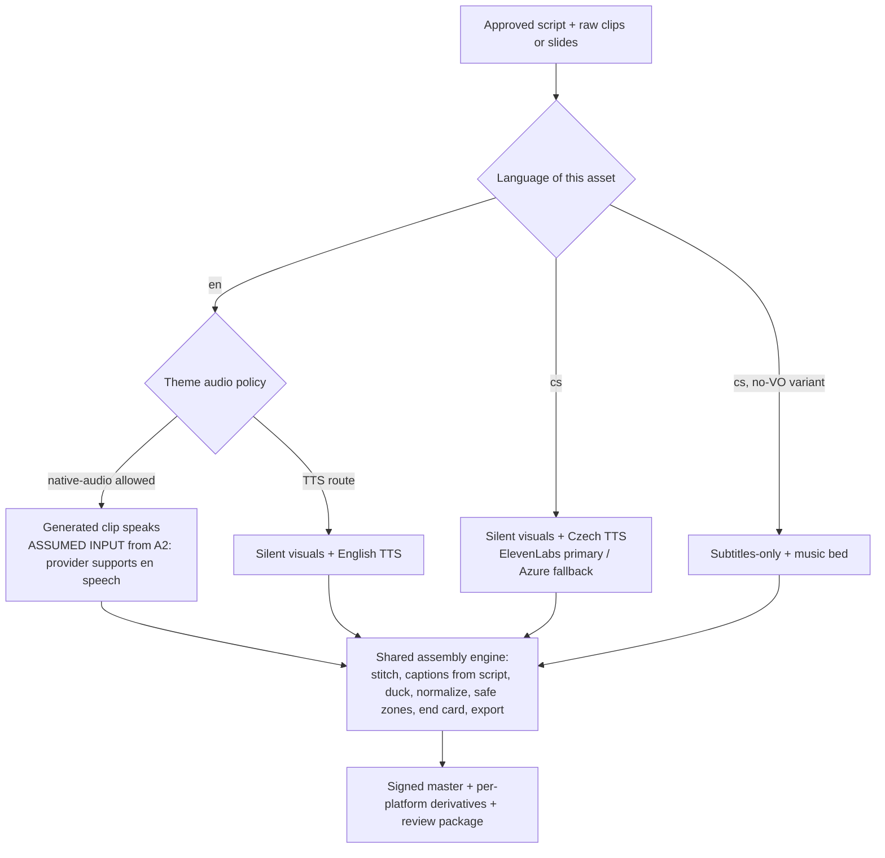

# A4 — Assembly & Post-Production Research Brief

**Wave 1, Agent T4 — the unowned middle of the video pipeline: everything between raw generated clips/slides and a publish-ready asset.**
Scope neighbors: generation best practices = A1; provider facts (Kie.ai, Higgsfield) = A2. Where this brief touches Higgsfield capabilities it says **ASSUMED INPUT (from A2)** and states a working assumption only.
Prepared: 2026-08-06. Design phase only — no code, no syntax, no folder trees.

---

## 1. What this means for the operator

After the AI models produce raw material — a few short video clips, a set of carousel slides, a voiceover script — someone still has to turn that into a finished reel: clips joined in order, captions burned in, music underneath that gets quieter when the voice speaks, the right loudness so it doesn't play weirdly quiet next to other videos, the right shape for each platform, and a short branded closing frame. That "finishing factory" is what this brief covers. It is where quality is won or lost, and it is nearly free to run compared to generation itself.

The main conclusions in plain words:

- **We should own the finishing factory ourselves**, built on the free, battle-tested FFmpeg toolkit that runs identically on Windows and Linux. Paid "assembly-by-API" services exist and are good, but they add a per-video fee and an internet dependency to a step that a local machine does for free. We keep a door open to plug one in later.
- **English and Czech need two slightly different recipes.** English videos may speak with the video model's own generated voice. Czech should be produced as *silent* video and voiced with a proper Czech text-to-speech voice (ElevenLabs or Microsoft Azure both do Czech well today) — or shipped with subtitles and music only. The difference is only in where the voice comes from; the rest of the factory is shared.
- **Never let the AI models draw Czech words on screen.** They still mangle háčky and čárky. All Czech text — captions, titles, slide text, the closing call-to-action — gets stamped on *after* rendering, using our own fonts. Then it is always spelled right.
- **Captions are always burned in**, word-by-word "karaoke" style, and the caption text comes from *our own script*, not from speech recognition — recognition is only used to get the timing. This sidesteps the fact that speech recognition makes roughly two to three times more mistakes in Czech than in English.
- **Music must be licensed** (a library subscription like Epidemic Sound/Artlist, or AI-generated music on a paid plan). Trending platform sounds are not licensed for brand content.
- **The new EU transparency rules for AI content took effect on 2 August 2026.** We mark our finished files in a machine-readable way and keep signed originals — but platforms strip those marks when we upload, so the honest promise is "we mark, we archive, we disclose at publish time," not "the label survives on TikTok."

---

## 2. Body

### 2.1 Stitching generated clips into 20–40 s reels — tooling landscape and workflow shapes

**The workflow shape** that current practice converges on: an ordered set of short generated clips → trimmed to beat length → joined (hard cuts dominate short-form; crossfades used sparingly for mood pieces) → overlay layers applied on top (captions, brand lock-up, progress hooks, end card) → audio bed mixed (VO + music with ducking) → loudness-normalized → encoded as a vertical 1080×1920 H.264/AAC MP4 master → per-platform derivatives. The critical architectural insight is that stitching is a *deterministic template job*, not a creative AI job: given the same clip list and template, the output is reproducible — which is exactly what an unattended cron run needs.

**Tool classes available in 2026:**

1. **FFmpeg direct** — the substrate everything else sits on. Concatenation, crossfade transitions, overlay compositing, subtitle burn-in via libass, Ken Burns motion on stills, loudness normalization (ITU-R BS.1770 loudnorm), sidechain ducking, and — since FFmpeg 8.0 (merged Aug–Sep 2025) — even a built-in local Whisper transcription filter that emits SRT/JSON. Free, scriptable, cross-platform, no network dependency, exit codes suitable for cron monitoring. Cost per asset: effectively zero. Downside: filter-graph complexity, no visual preview, limited motion-design vocabulary.
2. **Programmatic orchestration layers over FFmpeg** — MoviePy-class Python libraries treat clips as composable objects (cut, overlay text at a time and position, concatenate, export) and are described in 2026 reviews as "the right abstraction layer" for exactly this kind of pipeline; current 2026 guides cover clean Windows installation, which matters for our Windows-first constraint (D-05).
3. **Remotion-class renderers** (React components rendered frame-by-frame, encoded via FFmpeg) — the strongest option for rich branded motion graphics templates. Costs: a heavier runtime (Node + headless browser), a company licensing model for organizations, and slower renders. Sensible as a *later-phase premium template* layer, not as the v1 engine.
4. **Cloud assembly APIs** — Shotstack, Creatomate, JSON2Video (detailed in §2.8). A JSON-described timeline goes in; a rendered MP4 comes back by webhook. Mature, documented, integration-friendly (n8n/Make), and priced per rendered minute.
5. **Provider-bundled studios** — **ASSUMED INPUT (from A2):** working assumption that a Higgsfield-style "marketing studio" bundles generation plus basic assembly/reframing conveniently for interactive use, but offers limited caption styling control, unproven Czech text/TTS handling, and weaker unattended-API ergonomics than a dedicated assembly layer. If A2's findings contradict this, the build-vs-buy weighting in §2.8 must be revisited.

**Recommended shape:** a local FFmpeg-core assembly engine driven by internal timeline descriptions produced by the content pipeline, with a thin adapter seam so a cloud assembly API could substitute for the local engine per theme or per run. Stitching, captioning, audio, and export are stages of one assembly component, not scattered responsibilities.

### 2.2 Carousel-to-reel transform (assignment-named requirement)

A multi-slide carousel already contains a narrative arc (hook slide → value slides → CTA slide). The transform to a 20–40 s reel is mechanical:

- **Slide timing:** roughly 2.5–4 s per slide, hook slide slightly longer; 20–40 s therefore fits 7–13 slides — which is exactly the typical carousel length. Timing can optionally stretch to match a narration track (scene lasts as long as its voice line).
- **Motion:** slow Ken Burns pan/zoom per slide so the frame is never static. FFmpeg's zoompan approach is well documented (Bannerbear maintains a current guide); Kdenlive-ecosystem tooling even demonstrates beat-synchronized slide transitions as an established practice.
- **Transitions:** quick crossfade or hard cut between slides; one transition style per template to avoid slop.
- **TTS/music overlay:** a narration track generated from the slide copy or a dedicated spoken script (see §2.5), plus a music bed with ducking (§2.4). A subtitles-plus-music variant with no narration is also a legitimate platform-native format (TikTok "slideshow" style).

**Tool options:** (a) the local FFmpeg engine — zoompan + crossfade + audio mix covers the whole transform; (b) cloud assembly APIs — JSON2Video/Creatomate scene models map one-to-one onto slides, and JSON2Video bundles TTS voices (Azure, ElevenLabs) into the render credit; (c) consumer SaaS slideshow makers (Fliki, WaveGen) prove the pattern but are interactive-first and weak for cron.

**Strategic point for this product:** carousel-to-reel is the *safest Czech video format we have*. Every pixel of text is our own typography (diacritics perfect, §2.6), the voice is proper Czech TTS (§2.5), and no generative video model is involved at all — so no F-5/F-7 risk. It should be the default cs reel recipe and a near-free variant for en. It is also the cheapest reel per asset since it reuses already-generated carousel art.

### 2.3 Burned-in captions — tooling

**The architecture insight that changes everything for Czech:** this pipeline *authors its own scripts*. Caption **text** should therefore never come from speech recognition — it comes from the script verbatim. Speech recognition / forced alignment is used **only to time** the words against the audio. Displayed-text accuracy then becomes 100% by construction in both languages, and the Czech ASR accuracy gap only degrades *timing*, not *content*.

**Accuracy, English vs Czech (why raw ASR captions are unacceptable for cs):** Whisper large achieves roughly 5–7% word error rate on English versus ~15.9% on Czech (VoxPopuli benchmark; the medium model is 18.4% cs vs 7.6% en). Czech's rich morphology is a known driver. Two-to-three-times worse means visibly wrong burned-in words — a brand-quality failure.

**Timing tooling:**
- **WhisperX** — faster-whisper transcription + wav2vec2 forced alignment gives ±50 ms word-level timestamps (vanilla Whisper is ±500 ms). Czech is *not* among the default alignment languages (en, fr, de, es, it); a Hugging Face Czech alignment model must be configured. Feasibility is proven: the ParCzech4Speech corpus project used WhisperX recognition + forced alignment on Czech parliamentary audio at scale.
- **FFmpeg 8.0 whisper filter** — local, no-cloud transcription emitting SRT/JSON inside the same binary we already run; convenient for cron but sentence-level oriented; use for QA (does the audio say what the script says?) rather than karaoke timing.
- **TTS-native timestamps** — when the VO is synthesized (the cs path always is), the TTS provider can return character/word timing directly (ElevenLabs exposes timestamps), eliminating ASR from the caption path entirely. This is the preferred timing source wherever available.

**Styling / karaoke control:** word-by-word "karaoke" reveal requires the ASS subtitle format burned via FFmpeg/libass — SRT cannot animate words. The ASS/libass path gives full control: brand fonts, colors, outline, pop/highlight timing per word. Two operational requirements: (a) chosen brand fonts must have **complete Czech glyph coverage** (ř, ě, ů, ď, ť, ň in all weights) — a design-time checklist item; (b) fonts must be shipped with the app and referenced explicitly so Windows and Linux render pixel-identically (libass font resolution differs across OSes — a real D-05 parity trap if left to system fonts).

**Caption SaaS/APIs (buy option for styling):** Submagic (API since July 2025; claims 99% accuracy across 48+ languages), ZapCap (styled burn-in captioning API around $0.10/min, positioned as ~7× cheaper than Submagic), OpusClip captions API (early access; publishes 92–97% word accuracy on clear *English*), VEED subtitle styling API. All make broad multi-language claims; none publishes Czech-specific accuracy. Verdict: nice-to-have styling accelerators for en; for cs they must pass a pilot test before any reliance, and the script-first ASS path must exist regardless.

### 2.4 Music bed, ducking, loudness, licensing

**Music sources ranked for a marketing pipeline:**
1. **Licensed library subscription** — Epidemic Sound Commercial (~$59.99/mo) covers business use including paid ads across platforms; Artlist Pro (~$17–20/mo annual) covers commercial/client work. One subscription covers unlimited assets — the correct economics for a cron pipeline.
2. **AI-generated music** — Suno Pro/Premier ($10/$30 per month) grants full commercial rights to generated output and is not registered in Content ID; Udio paid plans grant commercial use; ElevenLabs Music launched (Aug 2025) with commercially licensed output from day one. Context: after the 2024 RIAA lawsuits, both Suno and Udio settled with major labels by late 2025, so the legal ground is firming — but US Copyright Office guidance still holds that purely AI output isn't copyrightable, so we get a *license to use*, not ownership. Acceptable for beds; per-theme legal preference.
3. **Platform trending audio — prohibited for brand content.** TikTok's general music library is not licensed for commercial use; the TikTok Commercial Music Library is rights-cleared but *only inside TikTok* — useless for a multi-platform master. The pipeline must therefore mix its own bed and never depend on attach-sound-at-publish for the master asset.

**Ducking:** the standard automated pattern is sidechain compression — the VO track keys a compressor on the music bed (sensitive threshold, high ratio, ~30 ms attack, ~800 ms release are the commonly cited starting values), so music dips automatically under speech. FFmpeg's sidechaincompress filter does this locally; Auphonic-class services do it as a paid API if the buy route is ever preferred. Each track is loudness-normalized *before* the mix so neither dominates.

**Loudness targets (volatile — 2026 state):** master short-form to **−14 LUFS integrated with a −1.0 dBTP true-peak ceiling**. In 2026 all three short-form platforms (TikTok, Reels, Shorts) turn down hot masters *more* than the loudness gap, so "mastering loud" now plays back *quieter* — the old TikTok loudness-war advice is obsolete. FFmpeg's loudnorm (ITU-R BS.1770) in two-pass measure-then-apply mode is the local tool. **QA gate:** measured integrated LUFS and true peak are logged per asset into the human review package, and out-of-range assets fail closed.

### 2.5 VO/TTS tooling — quality tiers for English and Czech; the pipeline fork (F-5, F-7)

**Quality tiers for this product (both languages):**

| Tier | Options | Czech reality check |
|---|---|---|
| Premium expressive | ElevenLabs — v3 (74 languages incl. Czech, most expressive), Multilingual v2 (29 languages incl. Czech, most stable for long-form) | Czech is production-grade: a live Czech government phone deployment handles ~5,000 calls/day on ElevenLabs — strong real-world evidence, not just a checkbox on a language list |
| Cloud-neutral workhorse | Azure Neural TTS — cs-CZ voices (Vlasta, Antonin, Jitka+) plus the Neural HD tier (price cut to $22/M chars in March 2026); Google Cloud TTS (broad voice variety incl. cs) | Mature, cheap at volume, SSML control; prosody a notch below ElevenLabs but consistent |
| Budget/simple | OpenAI TTS, Amazon Polly | Few voices, limited Czech prosody control — acceptable for drafts only |

**Is a pipeline fork needed? Yes.** Native-audio video generation speaks materially worse non-English: current comparisons state Veo-class dialogue quality is "noticeably better in English than other languages," and native AI voices are broadly rated draft-quality even in English. Combined with F-7 (huge variance in Czech TTS quality — solved by pinning the two tiers above), the design conclusion:

- **EN recipe:** native-audio generation is *permitted* (subject to A2's provider findings) **or** silent video + English TTS — a per-theme choice. Captions burned in either way.
- **CS recipe:** **silent video + Czech TTS overlay** (ElevenLabs v3 / Multilingual v2 primary; Azure Neural fallback and cost-saver), **or** subtitles-only + music bed. Model-native Czech speech is banned in v1.
- The fork lives at the **audio-sourcing stage only**; scripting, stitching, captions, ducking, loudness, export are one shared engine. In the theme configuration this is simply a named recipe per language.

**Fail-closed note for cron:** if the configured TTS provider is unreachable or the Czech voice is missing, the run degrades to the subtitles-only recipe or stops — it never falls back to model-native Czech speech.

### 2.6 Czech on-screen text (F-7 verification)

**Current state, verified:** garbled on-screen text remains a documented failure mode of video models (Sora-class guides dedicate whole workflows to fixing garbled non-English text, and the state of the art recommendation is explicitly "don't ask video models for text; overlay it in post"). Image models improved materially for *English* text in 2025–2026 (GPT-Images-2-class), but accuracy collapses on non-dominant character sets (a 2026 benchmark shows DALL-E-3-class models at ~20% on Chinese), and no published benchmark covers Czech diacritics at all — treat diacritic reliability as unproven at best. In Czech, diacritics are semantic, not decorative; a dropped háček changes the word.

**Policy (unblocked decision):**
1. **Never prompt generative image/video models to render Czech copy.** In-model text is allowed only as incidental *English* set dressing that carries no message.
2. **All message-bearing text — both languages — is applied post-render** by the assembly layer: captions via ASS/libass, titles/CTAs via text/overlay templates with bundled brand fonts (full Czech glyph coverage verified at theme-onboarding time).
3. Side benefits: post-render text always lands inside safe zones (§2.7), can be edited or re-languaged without re-generating video, and survives operator feedback loops cheaply.
4. QA rubric hook: any generated frame containing accidental legible gibberish text is a rejection criterion (feeds A1's quality rubric).

### 2.7 Per-destination aspect/safe-zone conversion and end cards

**Master and derivatives:** produce a 1080×1920 (9:16) master; derive 1:1 (1080×1080) for feed placements and 16:9 where a theme wants it. Because *we* composite every overlay, the correct conversion method is **layered re-composition** — re-run the template at the target ratio with the same layers — not naive cropping of a finished video.

**Safe zones (as of mid-2026 platform UIs; volatile, recheck quarterly):**
- TikTok 9:16: keep critical content ≥108 px from top, ≥320 px from bottom, ≥60 px left, ≥120 px right (≈900×1492 safe area in a 1080×1920 frame — right side is the interaction button stack, bottom is caption/CTA UI).
- Instagram Reels 9:16: ≈1080×1440 centered (≈250 px top/bottom buffers), right-side button stack (~996×1400 usable).
- **Universal cross-platform safe box: ≈900×1400 centered.** Designing captions, key visuals, and CTA text inside this one box lets a single master serve TikTok, Reels, and Shorts unchanged — the default for cron efficiency, with per-platform re-composition as a premium option.

**Ratio conversion with content synthesis (optional tier):** when a 9:16 asset must become 16:9 without letterboxing, 2026 offers AI outpainting/reframing services (PixVerse expand, WaveSpeed Video Outpainter, OpusClip AI reframe; Higgsfield also markets a reframer — **ASSUMED INPUT (from A2)** on its capability/pricing). These add cost and artifact risk; deferred as an optional enhancement since layered re-composition covers owned assets.

**End-card/CTA frames:** 2026 evidence is consistent that end-card-only CTAs underperform because viewers drop off before the final frame; effective practice is **layered CTA**: a soft mid-video cue around seconds 10–20, then a final CTA held 1.5–2.0 s with **dual delivery** (spoken + bold on-screen text), or — for loop-optimized assets — no outro at all so the video loops cleanly. Design consequence: the end card is a 2-second templated overlay (brand lock-up + theme-configured soft CTA, per language, safe-zone compliant), and the assembly engine also supports the "no end card, loop-friendly" recipe. This aligns with the product's soft-CTA constraint.

### 2.8 Build-vs-buy for assembly

Judged on the mandated criteria:

| Criterion | A — Local FFmpeg-class engine (FFmpeg + orchestration layer) | B — Cloud assembly API (Shotstack / Creatomate / JSON2Video) | C — Provider-bundled studio |
|---|---|---|---|
| Cron-unattended fit | Excellent: no network dependency, deterministic, clean exit codes, runs where the console app runs | Excellent mechanics (webhooks, documented n8n/Make integrations, render-status polling) but adds network + provider availability to the critical path | **ASSUMED INPUT (from A2):** assumed interactive-first, weak unattended API ergonomics |
| Cost per asset | ≈ $0 marginal (local compute only) | Meaningful at volume: Shotstack from $49/mo for 200 min 720p (~$0.25/min); Creatomate Essential $54/mo, ~14 credits/min of 2,000 at 720p25 (~$0.38/min) and raised prices in 2026; JSON2Video from $16.95/mo hobby tier with TTS bundled into render credits (Creatomate bills TTS *on top*) | Assumed bundled into generation credits; unknown until A2 |
| Windows-first local-binary consequence (D-05) | The one real cost of Option A: shipping/obtaining an FFmpeg binary. Core FFmpeg is LGPL 2.1+; enabling x264/x265 makes the build GPL. Because our console app invokes FFmpeg as a *separate process*, even a GPL build is low-risk, but *distributing* binaries triggers obligations (host corresponding source, license notices). Cleanest paths: require a managed install via OS package managers on both OSes, or bundle an LGPL build and use platform/hardware H.264 encoders | None — no local binary at all | None locally; full dependency on provider |
| Cross-platform parity | High, with two known traps to engineer around: font resolution for libass (fix: bundle fonts, reference explicitly) and codec availability drift between builds (fix: pin the FFmpeg version in both environments) | Perfect parity (server-rendered) | Unknown; assumed browser-based |
| Failure modes | Deterministic and testable: filter-graph bugs, font/codec issues — all reproducible locally; no third-party outage can stall a cron run | Network failures, provider outages, price/API changes (Creatomate's 2026 price rise is a live example), asset upload latency, data residency of brand material on third-party infra | Provider outage stalls both generation *and* assembly — a coupled single point of failure |

**Recommendation:** **Build on A as the engine of record** — zero marginal cost matches "runs every night on cron," determinism matches fail-closed requirements, and both OS targets are first-class. **Design the assembly stage behind an adapter** so a B-class API (JSON2Video is the best-priced automation fit; Shotstack the most battle-tested) can substitute per theme or serve as overflow/contingency without touching the rest of the pipeline. **C is not a substitute** for owned assembly under current assumptions; revisit only if A2's findings materially exceed the assumption.

Indicative bought-stack cost per 30 s reel if B were used end-to-end: ~$0.15–0.75 render + TTS + ~$0.10/min styled captions (ZapCap-class) — versus ≈ $0 marginal on Option A. At a daily-cron, multi-theme cadence this difference compounds into the strongest argument for building.

### 2.9 C2PA / provenance survival (F-8) — verified current state and the honest claim

**Legal state (verified this week):** EU AI Act **Article 50 applies from 2 August 2026** (four days before this brief). Providers of generative systems must mark outputs machine-readably as AI-generated; the Commission's guidelines plus the Code of Practice on Transparency of AI-generated Content are the compliance mechanism (non-adherents must show equivalent means); marking must be effective, interoperable, robust, and reliable "taking into account the state of the art." The May 2026 AI Omnibus provisional agreement grants systems already on the market before that date until **2 December 2026** to meet the Article 50(2) machine-readable-marking requirement. As deployer/creator of marketing content, our practical duties: keep machine-readable marks on what we produce, and disclose deepfake-like synthetic media visibly.

**Technical state (verified):** C2PA manifests are metadata attached to a specific file; **every re-encode strips them unless the pipeline re-signs**. Assembly is therefore inherently a stripping step — and so are the platforms: YouTube re-encodes every upload (provenance survives only as YouTube's own labels), Instagram reads inbound credentials to inform its AI label and then discards them, TikTok strips inbound manifests but reads them for auto-labeling and re-attaches *its own* Content Credentials; LinkedIn is currently the only major platform displaying inbound credentials as credentials. Conclusion: **provenance metadata does not survive publishing** on most target platforms, no matter what we do. By contrast, generation-time *invisible watermarks* (SynthID-class, embedded in pixels/audio by some providers) are designed to survive transforms — which providers embed them is A2's ledger; our duty is simply to never deliberately remove them.

**What an honest architecture claims (unblocked decisions):**
1. **Sign-at-export is a pipeline stage:** after the final encode of each master, sign a C2PA manifest (c2patool / Content Authenticity SDK class tooling) asserting AI-generation, toolchain, and theme/brand identity. Signing *before* final encode is pointless.
2. **The archive is the durable provenance record:** signed masters + manifests live in the run package. That archive — not the published file — is what demonstrates compliance and answers "was this ours / was this AI" later.
3. **Publish-time disclosure is a separate control:** the review package carries a per-asset "AI-generated — platform disclosure required" flag so the human (or a later Postiz-stage integration) sets each platform's AI-content toggle; platform labels, not our metadata, are what viewers actually see.
4. **Never claim end-to-end provenance survival.** The system's public claim is: marked at export, archived verifiably, disclosed at publish. Nothing more is technically true in 2026.

---

## 3. Decision table

| # | Decision UNBLOCKED by this research | → Architecture area |
|---|---|---|
| U1 | Assembly engine of record = local FFmpeg-core stack with a programmatic orchestration layer; deterministic template-driven timelines | Assembly component |
| U2 | Cloud assembly API sits behind an adapter seam as optional substitute/contingency (JSON2Video best automation economics; Shotstack most mature) | Assembly component / provider routing |
| U3 | en/cs **pipeline fork at the audio-sourcing stage only**: en may use native-audio (pending A2) or TTS; cs = silent video + Czech TTS, or subtitles-only; model-native Czech speech banned in v1; fail-closed to subtitles-only | Video pipeline + theme config (language recipes) |
| U4 | Czech TTS tiering: ElevenLabs (v3 / Multilingual v2) primary, Azure Neural cs-CZ fallback/cost tier | Media provider architecture |
| U5 | All message-bearing on-screen text (both languages) applied **post-render**; in-model Czech text prohibited; brand fonts with full Czech glyph coverage bundled with the app | Prompting policy + assembly templates |
| U6 | Captions: text always from the authored script; ASR/forced alignment (or TTS-native timestamps) used for timing only; karaoke via ASS/libass burn-in | Captions module |
| U7 | Audio mastering standard: −14 LUFS integrated / −1.0 dBTP; two-pass normalization; sidechain ducking of music under VO; measured values logged per asset as a QA gate | Audio module + review package |
| U8 | Music sourcing: licensed library subscription and/or paid-plan AI music; platform trending audio prohibited for the master asset | Licensing/ops policy |
| U9 | Single 9:16 master designed inside the ≈900×1400 universal safe box; per-ratio layered re-composition (not cropping) for 1:1 / 16:9 | Template system |
| U10 | End card = 2 s templated overlay with soft CTA (dual delivery), plus mid-video soft CTA; loop-friendly no-outro recipe also supported | Template system + voice/CTA rules |
| U11 | Carousel-to-reel is a first-class recipe and the default cs video format (Ken Burns motion + TTS/subtitles + music) | Video pipeline recipes |
| U12 | Provenance: sign-at-export stage, signed masters archived in run package, publish-time AI-disclosure flags in review package; no survival claims for published files | Compliance component + review package |

| # | Decision DEFERRED | → Open decision |
|---|---|---|
| D1 | Which (if any) caption-styling SaaS to add for en polish — and whether any handles Czech acceptably | Requires Czech pilot test of Submagic/ZapCap-class output |
| D2 | ElevenLabs vs Azure as *primary* cs voice at production volume (quality vs ~cost-per-character) | Pilot A/B with real scripts + budget model |
| D3 | Distribute/bundle FFmpeg binaries vs require managed install per OS (licensing + ops tradeoff, incl. GPL-vs-LGPL build choice for H.264) | Legal/ops review before build |
| D4 | AI outpainting/reframe services for ratio conversion beyond layered re-composition | Cost/quality test; partially depends on A2 (Higgsfield reframer) |
| D5 | AI-generated music vs library music per theme | Brand + legal preference per tenant |
| D6 | EN native-audio generation vs TTS-everywhere (voice consistency across assets vs per-clip authenticity) | Depends on A2 provider findings + A1 practice findings |
| D7 | Remotion-class motion-graphics template tier for premium branded output | Later phase; licensing + render-cost assessment |
| D8 | Build the cloud-assembly adapter in v1 or defer until a concrete need | Architecture sizing decision |
| D9 | Whether to write C2PA assertions naming the specific generation model per asset (richer audit vs provider-coupling) | Compliance detail with A2 input |

---

## 4. Fact ledger

All retrieved 2026-08-06. Confidence: H = multiple/authoritative sources; M = single credible source or vendor claim; L = weak/unverified.

| Claim | Source URL | Retrieved | Conf. | Recheck by |
|---|---|---|---|---|
| EU AI Act Article 50 applies from 2 Aug 2026; providers must add machine-readable marks enabling detection of AI-generated content; Code of Practice on Transparency is the compliance mechanism | https://digital-strategy.ec.europa.eu/en/policies/guidelines-transparency-ai-generated-content | 2026-08-06 | H | 2026-12-02 (Omnibus finalization) |
| AI Omnibus provisional agreement (May 2026) gives generative systems on the market before 2 Aug 2026 until 2 Dec 2026 to meet Art. 50(2) machine-readable marking | https://artificialintelligenceact.eu/transparency-rules-article-50/ | 2026-08-06 | M | 2026-11-01 |
| C2PA manifests are stripped by platform re-encoding: YouTube re-encodes all uploads; Instagram reads then discards credentials (label survives, record doesn't); TikTok strips inbound manifests, reads them for AI auto-labeling, and re-attaches its own credentials; LinkedIn displays inbound credentials | https://aimetadataremover.org/blog/does-instagram-keep-c2pa/ ; https://c2pa.ai/youtube ; https://c2pa.ai/tiktok ; https://www.lumethic.com/en/articles/content-credentials-social-media-platforms | 2026-08-06 | H | 2026-11-06 |
| Re-encoding/format conversion silently strips C2PA manifests; pipelines must re-sign after the final encode (c2patool supports read + attach on video) | https://www.ssl.com/article/preserving-c2pa-manifests-across-the-media-production-workflow/ ; https://opensource.contentauthenticity.org/docs/c2patool/ | 2026-08-06 | H | 2027-02-06 |
| Whisper large WER ≈ 15.9% Czech vs 7.2% English (VoxPopuli); medium 18.4% vs 7.6%; English overall ~5–6% | https://novascribe.ai/how-accurate-is-whisper ; https://github.com/openai/whisper | 2026-08-06 | H | 2027-02-06 (new ASR gens) |
| WhisperX: ±50 ms word timestamps via wav2vec2 forced alignment; default alignment models cover en/fr/de/es/it only — Czech needs a HF alignment model; Czech feasibility proven by ParCzech4Speech | https://github.com/m-bain/whisperX ; https://arxiv.org/pdf/2509.06675 | 2026-08-06 | H | 2027-02-06 |
| FFmpeg 8.0 ships a built-in local Whisper audio filter (SRT/JSON output, VAD, optional GPU), merged Aug–Sep 2025 | https://www.phoronix.com/news/FFmpeg-Lands-Whisper | 2026-08-06 | H | 2027-02-06 |
| Karaoke word-by-word burn-in requires ASS format + FFmpeg/libass; SRT cannot animate words; styled-caption API market includes ZapCap (~$0.10/min), Submagic (API since Jul 2025; claims 99% acc., 48+ languages), OpusClip captions API (early access; 92–97% word acc. on clear English) | https://zapcap.ai/api/ ; https://www.opus.pro/blog/add-captions-to-video-api ; https://zapcap.ai/blog/submagic-api/ | 2026-08-06 | M (vendor claims) | 2026-11-06 |
| ElevenLabs: v3 supports 74 languages incl. Czech; Multilingual v2 supports 29 incl. Czech (stable long-form choice) | https://elevenlabs.io/docs/overview/models ; https://help.elevenlabs.io/hc/en-us/articles/13313366263441-What-languages-do-you-support | 2026-08-06 | H | 2027-02-06 |
| ElevenLabs runs a live Czech government deployment at ~5,000 calls/day — production-grade Czech evidence | https://www.webfuse.com/elevenlabs-cheat-sheet | 2026-08-06 | M | 2027-02-06 |
| Azure Neural TTS offers cs-CZ voices (Vlasta, Antonin, Jitka+); Neural HD tier price cut to $22/M chars from March 2026 | https://techcommunity.microsoft.com/blog/azure-ai-foundry-blog/azure-speech-%e2%80%93-neural-hd-text-to-speech-recent-voice-updates/4505380 ; https://json2video.com/ai-voices/azure/languages/czech/ | 2026-08-06 | H | 2026-12-06 (pricing volatile) |
| Native-audio video models: dialogue quality noticeably better in English than other languages (Veo 3.1-class); native AI voices rated draft-quality | https://www.atlascloud.ai/blog/guides/ai-video-models-native-audio-compared ; https://skywork.ai/blog/how-to-audio-aware-prompting-veo-3-1-guide/ | 2026-08-06 | M | 2026-11-06 (fast-moving) |
| On-screen text remains a documented failure mode of video models, worst for non-English scripts/diacritics; state-of-practice workaround is post-production text overlay; no Czech-diacritics benchmark exists | https://help.apiyi.com/en/sora-2-chinese-text-video-fix-guide-en.html ; https://glmimage.app/blog/best-ai-text-rendering | 2026-08-06 | M | 2026-11-06 (fast-moving) |
| Short-form mastering 2026: target −14 LUFS integrated / −1.0 dBTP; TikTok, Reels, Shorts all turn down hot masters more aggressively than the loudness gap in 2026 (loudness-war mastering now backfires) | https://mrvocal.com/posts/loudness-for-shorts ; https://mixinggpt.com/blog/mixing-mastering-streaming-loudness-2026 | 2026-08-06 | M | 2026-12-06 |
| FFmpeg sidechaincompress ducks music under VO (documented pattern: sensitive threshold, high ratio, ~30 ms attack / ~800 ms release); loudnorm implements ITU-R BS.1770 two-pass normalization | https://www.ffmpeglab.com/articles/ffmpeg-audio-mixing-amix-guide.html | 2026-08-06 | H | 2027-08-06 (stable) |
| Safe zones mid-2026: TikTok 108/320/60/120 px (top/bottom/left/right) in 1080×1920; IG Reels ≈1080×1440 centered (~996×1400 usable); universal cross-platform safe box ≈900×1400 centered | https://kreatli.com/guides/tiktok-safe-zone ; https://kreatli.com/guides/safe-zone-guide ; https://postplanify.com/blog/social-media-safe-zones-2026-complete-guide | 2026-08-06 | M | 2026-11-06 (UI changes) |
| End-card-only CTAs underperform due to pre-end drop-off; layered CTA (mid-video cue ~s10–20 + final 1.5–2.0 s dual-delivery CTA) or loop-friendly no-outro is 2026 practice | https://firstframetools.com/blog/short-form-video-cta-examples ; https://www.socialync.io/blog/short-form-video-structure-guide-2026 | 2026-08-06 | M | 2027-02-06 |
| Assembly API pricing 2026: Shotstack from $49/mo (200 min 720p); Creatomate Essential $54/mo ≈2,000 credits (~14 credits/min 720p25) and raised prices in 2026 (TTS billed on top); JSON2Video added $16.95/mo hobby tier with TTS (Azure, ElevenLabs) inside render credits; JSON2Video has documented n8n/Make integrations with webhook delivery | https://samautomation.work/blog/best-video-apis-developers-2026/ ; https://json2video.com/how-to/creatomate-alternative/ ; https://json2video.com/how-to/shotstack-alternative/ | 2026-08-06 | M (some figures from JSON2Video's own comparison pages — competitor bias) | 2026-11-06 |
| FFmpeg licensing: core LGPL 2.1+ (closed-source commercial use OK with notices + source hosting for distributed binaries); enabling x264/x265 makes the build GPL; GPL parts are opt-in at build time | https://www.ffmpeg.org/legal.html ; https://x264.org/licensing/ | 2026-08-06 | H | 2027-08-06 (stable) |
| Music licensing: Epidemic Sound Commercial ≈$59.99/mo covers business/paid use cross-platform; Artlist Pro ≈$17–20/mo; TikTok Commercial Music Library is rights-cleared for verified businesses but TikTok-only; TikTok's general library is not licensed for commercial/brand use | https://www.foximusic.com/blog/commercial-music-licensing-tiktok-guide/ ; https://newsroom.tiktok.com/en-us/commercial-music-library ; https://stackinfluence.com/blog/find-royalty-free-commercial-music-for-tiktok | 2026-08-06 | M | 2026-12-06 |
| AI music: Suno Pro/Premier ($10/$30) grants full commercial rights, output not in Content ID; Udio paid plans grant commercial use; ElevenLabs Music (Aug 2025) commercially licensed from day one; Suno & Udio settled with major labels by late 2025; USCO: purely AI output not copyrightable | https://terms.law/forum/thread/suno-ai-music-commercial-license.html ; https://blog.dubspot.com/ai-music-licensing-explained-2026 ; https://www.aimagicx.com/blog/suno-vs-udio-vs-elevenlabs-music-comparison-2026 | 2026-08-06 | M | 2026-12-06 (settlement terms evolving) |
| AI reframe/outpainting for ratio conversion is a mature 2026 service category (PixVerse expand, WaveSpeed Video Outpainter, OpusClip AI reframe, Envato VideoGen Reframe); auto-reframe crops, outpainting synthesizes | https://wavespeed.ai/blog/posts/wavespeedai-video-outpainter/ ; https://www.opus.pro/tools/change-video-aspect-ratio | 2026-08-06 | M | 2026-11-06 |
| MoviePy-class Python orchestration over FFmpeg is current practice for programmatic assembly incl. Windows (2026 install guides); Remotion renders React compositions frame-by-frame with FFmpeg encoding | https://thelinuxcode.com/how-to-install-moviepy-on-windows-2026-guide-pip-conda-ffmpeg-and-a-real-export-smoke-test/ ; https://dev.to/dwelvin_morgan_38be4ff3ba/why-i-chose-remotion-ffmpeg-for-server-side-video-rendering-4c1g | 2026-08-06 | M | 2027-02-06 |
| Ken Burns slideshow assembly with FFmpeg (zoompan) is documented practice; beat-synced slideshow tooling exists in the open-source ecosystem | https://www.bannerbear.com/blog/how-to-do-a-ken-burns-style-effect-with-ffmpeg/ ; https://github.com/michalfapso/kdenlive_slideshow_editor | 2026-08-06 | H | 2027-08-06 (stable) |

Volatile-claim freshness: of the ~20 volatile rows above, ~70% rest on 2026-dated sources (EU guidance, platform C2PA behavior, safe zones, loudness, API pricing, Azure pricing, AI-music legal state), satisfying the ≥60% Feb-2026+ requirement.

---

## 5. Sources

- European Commission — Guidelines on transparency obligations for AI-generated content (Art. 50, applies 2 Aug 2026): https://digital-strategy.ec.europa.eu/en/policies/guidelines-transparency-ai-generated-content — retrieved 2026-08-06
- EU AI Act explainer — Article 50 practical guide incl. May 2026 Omnibus grace period: https://artificialintelligenceact.eu/transparency-rules-article-50/ — retrieved 2026-08-06
- SSL.com — Preserving C2PA manifests across media production workflows: https://www.ssl.com/article/preserving-c2pa-manifests-across-the-media-production-workflow/ — retrieved 2026-08-06
- Content Authenticity Initiative — c2patool documentation: https://opensource.contentauthenticity.org/docs/c2patool/ — retrieved 2026-08-06
- AI Metadata Remover — What survives an upload to 6 platforms (C2PA, 2026): https://aimetadataremover.org/blog/does-instagram-keep-c2pa/ — retrieved 2026-08-06
- C2PA.ai — platform support pages (YouTube / TikTok / Instagram, 2026): https://c2pa.ai/youtube , https://c2pa.ai/tiktok , https://c2pa.ai/instagram — retrieved 2026-08-06
- Lumethic — Content Credentials on LinkedIn, Instagram, X, TikTok: https://www.lumethic.com/en/articles/content-credentials-social-media-platforms — retrieved 2026-08-06
- VexaScribe — Whisper accuracy by language (2026 WER data): https://novascribe.ai/how-accurate-is-whisper — retrieved 2026-08-06
- OpenAI — Whisper repository (language performance): https://github.com/openai/whisper — retrieved 2026-08-06
- m-bain — WhisperX (forced alignment, default language list): https://github.com/m-bain/whisperX — retrieved 2026-08-06
- ParCzech4Speech — Czech speech corpus built with WhisperX alignment (arXiv, Sep 2025): https://arxiv.org/pdf/2509.06675 — retrieved 2026-08-06
- Phoronix — FFmpeg 8.0 merges Whisper filter (Aug 2025): https://www.phoronix.com/news/FFmpeg-Lands-Whisper — retrieved 2026-08-06
- ZapCap — Captioning API and Submagic comparison (2026): https://zapcap.ai/api/ , https://zapcap.ai/blog/submagic-api/ — retrieved 2026-08-06
- OpusClip — Add captions via API (2026 guide): https://www.opus.pro/blog/add-captions-to-video-api — retrieved 2026-08-06
- ElevenLabs — Models & supported languages docs: https://elevenlabs.io/docs/overview/models , https://help.elevenlabs.io/hc/en-us/articles/13313366263441-What-languages-do-you-support — retrieved 2026-08-06
- Webfuse — ElevenLabs cheat sheet 2026 (Czech gov deployment): https://www.webfuse.com/elevenlabs-cheat-sheet — retrieved 2026-08-06
- Microsoft — Azure Neural HD TTS voice updates (Mar 2026 pricing): https://techcommunity.microsoft.com/blog/azure-ai-foundry-blog/azure-speech-%e2%80%93-neural-hd-text-to-speech-recent-voice-updates/4505380 — retrieved 2026-08-06
- JSON2Video — Azure Czech voices catalog: https://json2video.com/ai-voices/azure/languages/czech/ — retrieved 2026-08-06
- Atlas Cloud — AI video models with native audio compared (Veo 3.1 / Kling 3.0 / Vidu Q3, 2026): https://www.atlascloud.ai/blog/guides/ai-video-models-native-audio-compared — retrieved 2026-08-06
- Apiyi — Fixing garbled non-English text in Sora 2 videos (workflow incl. post-production overlay): https://help.apiyi.com/en/sora-2-chinese-text-video-fix-guide-en.html — retrieved 2026-08-06
- GLMImage — AI text-rendering benchmark 2026 (non-Latin accuracy collapse): https://glmimage.app/blog/best-ai-text-rendering — retrieved 2026-08-06
- Mr. Vocal — Loudness for Shorts: practical LUFS guide (TikTok/Reels/Shorts, 2026): https://mrvocal.com/posts/loudness-for-shorts — retrieved 2026-08-06
- MixingGPT — Mixing/mastering for streaming 2026 loudness rules: https://mixinggpt.com/blog/mixing-mastering-streaming-loudness-2026 — retrieved 2026-08-06
- FFmpegLab — Mixing audio in FFmpeg (amix, ducking via sidechaincompress, loudnorm): https://www.ffmpeglab.com/articles/ffmpeg-audio-mixing-amix-guide.html — retrieved 2026-08-06
- Kreatli — Safe Zone Hub 2026 + TikTok safe zone (July 2026 figures): https://kreatli.com/guides/safe-zone-guide , https://kreatli.com/guides/tiktok-safe-zone — retrieved 2026-08-06
- PostPlanify — Social media safe zones 2026 complete guide: https://postplanify.com/blog/social-media-safe-zones-2026-complete-guide — retrieved 2026-08-06
- First Frame — Short-form CTA examples (layered CTA, 2026): https://firstframetools.com/blog/short-form-video-cta-examples — retrieved 2026-08-06
- Socialync — Short-form video structure guide 2026 (hook/body/payoff, outro options): https://www.socialync.io/blog/short-form-video-structure-guide-2026 — retrieved 2026-08-06
- Samautomation — Best video APIs 2026 (Shotstack vs Creatomate vs JSON2Video, pricing): https://samautomation.work/blog/best-video-apis-developers-2026/ — retrieved 2026-08-06
- JSON2Video — Creatomate & Shotstack pricing comparisons (2026; vendor-authored, bias noted): https://json2video.com/how-to/creatomate-alternative/ , https://json2video.com/how-to/shotstack-alternative/ — retrieved 2026-08-06
- FFmpeg — License and legal considerations: https://www.ffmpeg.org/legal.html — retrieved 2026-08-06
- x264 — Licensing: https://x264.org/licensing/ — retrieved 2026-08-06
- Foxi Music — Commercial music licensing on TikTok, 2026 brand guide: https://www.foximusic.com/blog/commercial-music-licensing-tiktok-guide/ — retrieved 2026-08-06
- TikTok Newsroom — Commercial Music Library & Artist Impact Program: https://newsroom.tiktok.com/en-us/commercial-music-library — retrieved 2026-08-06
- Terms.law — Suno commercial-use license analysis (2026): https://terms.law/forum/thread/suno-ai-music-commercial-license.html — retrieved 2026-08-06
- Dubspot — AI music licensing explained 2026 (Suno/Udio settlements, USCO stance): https://blog.dubspot.com/ai-music-licensing-explained-2026 — retrieved 2026-08-06
- AI Magicx — Suno vs Udio vs ElevenLabs Music 2026: https://www.aimagicx.com/blog/suno-vs-udio-vs-elevenlabs-music-comparison-2026 — retrieved 2026-08-06
- WaveSpeed — Video Outpainter (aspect conversion via outpainting): https://wavespeed.ai/blog/posts/wavespeedai-video-outpainter/ — retrieved 2026-08-06
- OpusClip — AI reframe tool (aspect conversion): https://www.opus.pro/tools/change-video-aspect-ratio — retrieved 2026-08-06
- TheLinuxCode — MoviePy on Windows, 2026 guide: https://thelinuxcode.com/how-to-install-moviepy-on-windows-2026-guide-pip-conda-ffmpeg-and-a-real-export-smoke-test/ — retrieved 2026-08-06
- DEV — Remotion + FFmpeg for server-side rendering: https://dev.to/dwelvin_morgan_38be4ff3ba/why-i-chose-remotion-ffmpeg-for-server-side-video-rendering-4c1g — retrieved 2026-08-06
- Bannerbear — Ken Burns effect with FFmpeg: https://www.bannerbear.com/blog/how-to-do-a-ken-burns-style-effect-with-ffmpeg/ — retrieved 2026-08-06
- michalfapso — Kdenlive slideshow editor (beat-synced Ken Burns): https://github.com/michalfapso/kdenlive_slideshow_editor — retrieved 2026-08-06
